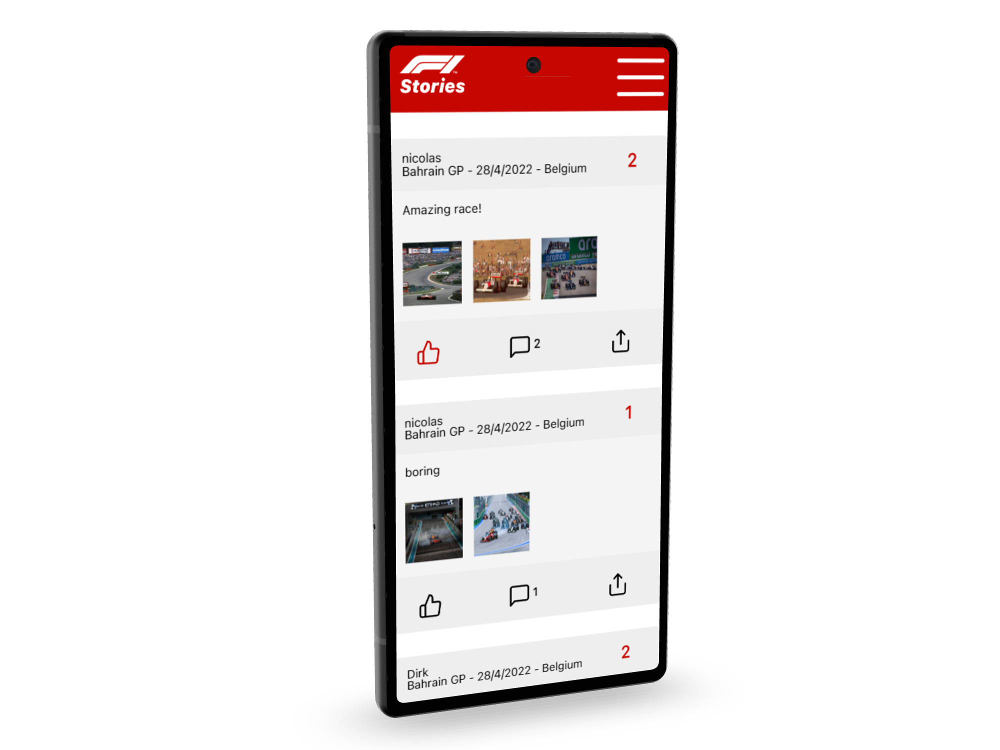

# F1 Stories: NMA
NMA that allows users to write about their experiences at Formula One Races.

## Features:
- Create an acccount!
- View and interact with other people's stories!
- Scan race barcodes to add them to your profile!
- Create your own stories!
- and much more

## Description
This NMA is compatible with both backends, the one used in the production environment is the Laravel one.
The NodeJS backend is not available online.

The add race menu will scan the code-128 barcode format and qr code format, the accepted values are the race titles.      
I used <a href="https://barcode.tec-it.com/en/Code128?data=Bahrain%20GP">this</a> generator. If you want to create another race code, grab a title value from <a href="https://f1stories.herokuapp.com/api/races">this</a> endpoint and generate the code.
For generating QR codes, I used <a href="https://www.qr-code-generator.com/">this</a> website, click on text and then enter "Bahrain GP" or any other race title and you can scan it.

## personal note(not handed in with the assignment :P)
This course was in my opinion taught very chaotically to us, and I'm not really that proud of what I delivered here in terms of code quality, this could have been done so much better but this is what I managed to deliver in a very busy semester
